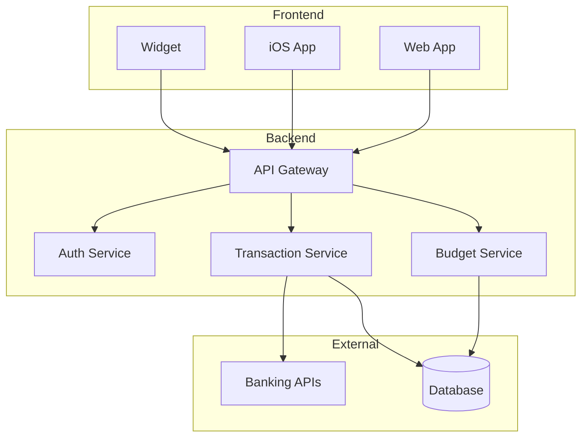
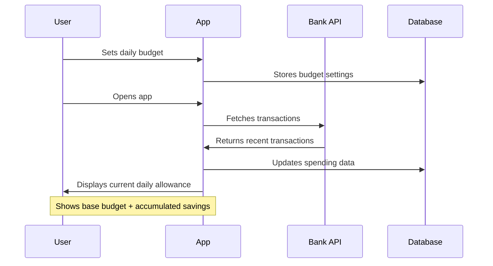
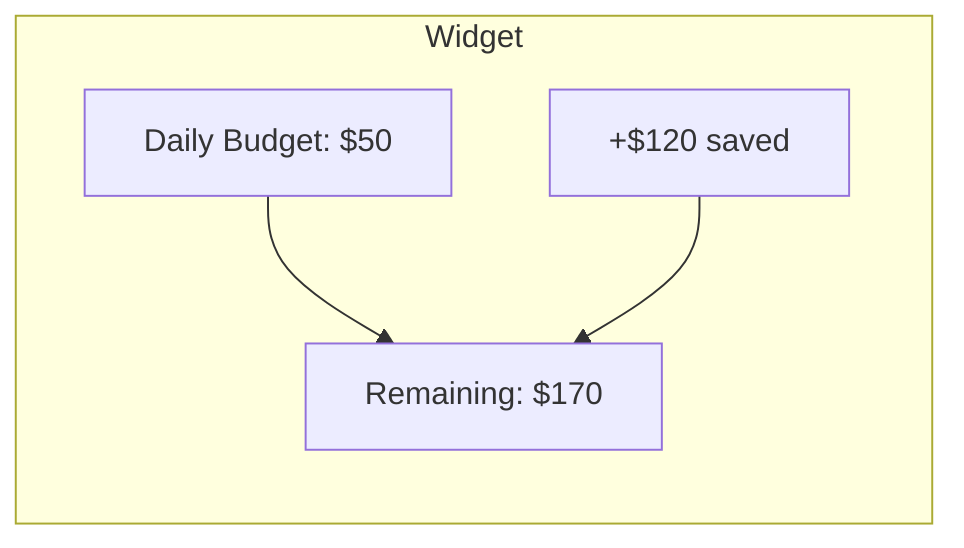

# Daily Budget App

A modern financial management application designed to help users maintain daily spending discipline through real-time bank integration and intuitive budget tracking.

## Overview

DailyBudget provides immediate feedback on daily spending limits while accumulating saved amounts for future use. The app offers real-time balance tracking through bank API integration, daily spending limits with automatic updates, and a rollover system for unused daily budget.

## System Architecture



## User Flow



## Widget Design



## Core Features

### Daily Budget Management
- Real-time balance tracking through bank API integration
- Daily spending limit with automatic updates
- Rollover system for unused daily budget
- Visual indicators for accumulated savings
- User authentication
- Daily budget tracking and visualization
- Transaction management with automatic category prediction
- Bank account integration
- Planned expenses management
- Income source tracking
- Interactive charts and analytics

## Tech Stack

### Frontend
- React.js with TypeScript
- TailwindCSS
- Shadcn UI
- Recharts for data visualization

### Backend
- Express.js
- Node.js
- PostgreSQL with Drizzle ORM
- Passport.js for authentication
- JWT authentication
- Bank API integration

### Testing
- Vitest
- React Testing Library
- Comprehensive test suite

## Getting Started

1. Clone the project in Replit
2. Install dependencies:
```bash
npm install
```
3. Set up your environment variables in Replit's Secrets tab
4. Start the development server:
```bash
npm run dev
```

The application will be available on port 5000.

## Development Commands

- `npm run dev` - Start development server
- `npm run build` - Build for production
- `npm run check` - Type checking
- `npm test` - Run tests
- `npm run db:push` - Update database schema

## Project Structure

- `/client` - React frontend application
- `/server` - Express.js backend
- `/db` - Database schema and configuration
- `/components` - Reusable UI components
- `/hooks` - Custom React hooks
- `/services` - Business logic and external services

## Security Considerations

- End-to-end encryption for all financial data
- Secure storage of banking credentials
- Regular security audits
- Compliance with financial regulations

## Development Roadmap

### Phase 1: Core Application
- Basic budget tracking functionality
- Bank API integration
- Web app development
- Widget implementation

### Phase 2: Enhanced Features
- Smart categorization system
- Advanced analytics
- Machine learning integration
- Expanded widget functionality

### Phase 3: Ecosystem Development
- Additional financial services integration
- Cross-platform expansion
- Advanced reporting features
- Social features and sharing capabilities

## License

MIT